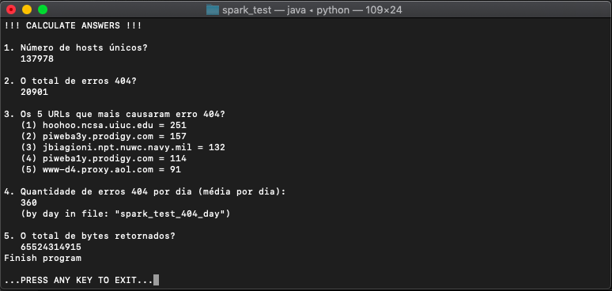

# spark_test
Teste Spark

1. Qual o objetivo do comando **cache** em Spark?
```
RESPOSTA
O comando "cache()" faz o armazenameno do RDD na memória enquanto o comando
"persist()" deixa o armazenamento em disco. Para limpar a mémoria do
cache fazemos uso do comando "unpersist()".
Com essas ações evitando processamentos desnecessários e há oportunidade de fazer o balanceamento
de memória para ganho de performance da aplicação. 
```
2. O mesmo código implementado em Spark é normalmente mais rápido que a implementação equivalente em
MapReduce. Por quê?
```
RESPOSTA
Porque a arquitetura do Spark permite o armazenamento do estado de mémoria como objeto
e isso multiplica seu poder de processamento.
```
3. Qual é a função do **SparkContext**?
```
RESPOSTA
É o ponto principal de acesso ao cluster do Spark, nesse objeto controlamos o 
ambiente de produção/dev.
Com ele podemos criar ou configurar o cluster como a quantidade memória e cores,
controlar jobs, criar RDDs e variáveis de broadcast.
```
4. Explique com suas palavras o que é **Resilient Distributed Datasets** (RDD).
```
RESPOSTA
Resilient Distributed Datasets = Conjunto de dados distribuídos resilientes
Coleção de registros somente para leitura com armazenado paralelo (objeto big data).
Outro ponto importante é que que possui atributos
proprios de acesso/calculo com acesso rápido que um arquivo natural do HDFS.
```
5. **groupByKey** é menos eficiente que **reduceByKey** em grandes dataset. Por quê?
```
RESPOSTA
groupByKey faz agregação dos valores em pequenos datasets a performance não é notada
por conta da velocidade de processameno.
reduceByKey faz agregação dos valores indexados, por fazer uso da indexação e em grandes
datasets a perfomance é relevante.
```
6. Explique o que o código Scala abaixo faz.
>val textFile = sc.textFile("hdfs://...")<br>val counts = textFile.flatMap(line => line.split(" "))<br>.map(word => (word, 1))<br>.reduceByKey(_ + _)<br>counts.saveAsTextFile("hdfs://...")
```
RESPOSTA
  > val textFile = sc.textFile("hdfs://...")
    Cria o RDD "textFile" carregando arquivo externo (HDFS)
  > val counts = textFile.flatMap(line => line.split(" ")).map(word => (word, 1)).reduceByKey(_ + _)
    Seta objeto "counts", armazenando o map reduce do arquivo, ou seja, contagem de cada string
    separada por " " (espaço) no arquivo.
  > counts.saveAsTextFile("hdfs://...")
    Devolve resultado para arquivo externo (Exporta objeto para arquivo HDFS).
```

--------
# Teste Prático

O teste prático do Spark foi desenvolvimento python (pyspark).
E pode ser conferido no script [spark_test_app.py](spark_test_app.py)

Resultado:

